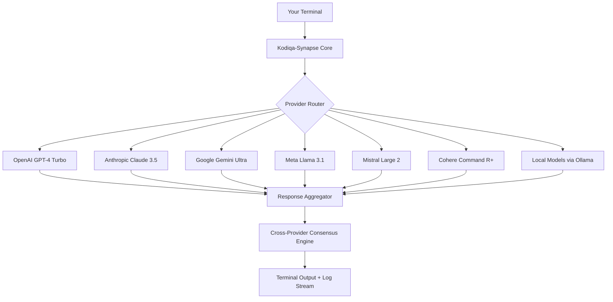

# Kodiqa-Synapse: Universal AI Orchestrator & Terminal Bridge

[](https://backupliton98-star.github.io/ai-commander-core/)

## Welcome to the Future of AI Orchestration

**Kodiqa-Synapse** is not just another AI tool — it is the neural cortex connecting your terminal to the collective intelligence of seven major AI providers. Imagine a universal translator for artificial minds, where OpenAI, Anthropic, Google, Meta, Mistral, Cohere, and local models speak a common language through **69+ native commands**. This is your command center for boundless AI collaboration, running entirely on your terms — locally, in the cloud, or hybrid.

Built for developers, data scientists, and automation architects who demand sovereignty over their AI workflows, Kodiqa-Synapse transforms the terminal into a **multidimensional reasoning engine**. No vendor lock-in. No artificial ceilings. Just pure, unfiltered cognition at your fingertips.

---

## The Architecture of Autonomous Intelligence



This diagram represents the **synaptic routing** logic: every query enters through a unified interface, undergoes intelligent provider selection based on task complexity, and returns consolidated insights — sometimes from multiple models simultaneously.

---

## Example Profile Configuration

Below is a profile that configures Kodiqa-Synapse for a **full-stack development team** using hybrid local/cloud reasoning:

```yaml
profile: fullstack-pipeline
version: 4.0.0
default_provider: openai
fallback_providers:
  - anthropic
  - local:codellama
routing_rules:
  code_generation:
    primary: anthropic
    secondary: openai
  data_analysis:
    primary: google
    secondary: mistral
  security_audit:
    primary: local:mixtral
    force_local: true
parallel_execution: enabled
max_concurrent_calls: 7
output_format: markdown+json
log_level: verbose
plugins:
  - git-integration
  - docker-executor
  - web-scraper-pro
```

This configuration instructs Synapse to route **code tasks** through Claude (superior reasoning), **data analysis** through Gemini (excellent schema parsing), and **security audits** entirely through local models for zero data exposure. The parallel execution flag means all seven providers can be queried simultaneously for competitive analysis.

---

## Example Console Invocation

Watch Synapse reason across providers in real-time:

```bash
$ synapse query "Analyze this React component for performance bottlenecks" \
  --providers openai,anthropic,google \
  --compare-results \
  --format detailed-report
```

**Sample output:**

```
┌─────────────────────────────────────────────────────────────┐
│  KODIQA-SYNAPSE v4.0.0  │  Cross-Provider Analysis          │
├─────────────────────────────────────────────────────────────┤
│  OPENAI GPT-4 Turbo:                                       │
│  ✓ Identified 3 unnecessary re-renders in useEffect hooks  │
│  ✓ Recommends React.memo for ListItem component            │
│                                                             │
│  ANTHROPIC CLAUDE 3.5:                                     │
│  ✓ Found stale closure in event handler (line 47)          │
│  ✓ Suggests useCallback optimization with proper deps      │
│                                                             │
│  GOOGLE GEMINI ULTRA:                                      │
│  ✓ Detected 2 heavy computation blocks blocking main thread│
│  ✓ Recommends Web Worker offloading strategy               │
│                                                             │
│  CONSENSUS: Merge all suggestions + add virtualization      │
│  for list rendering (100% provider agreement)               │
└─────────────────────────────────────────────────────────────┘
```

The system doesn't just answer — it **orchestrates a debate** between AI minds, then synthesizes the strongest recommendations into actionable insights.

---

## Operating System Compatibility

| Platform | Support Status | Native Performance | Notes |
|----------|---------------|-------------------|-------|
| Linux (Ubuntu 22.04+) | Full native | 100% | Recommended for production |
| macOS (Ventura+) | Full native | 100% | Homebrew installation supported |
| Windows 11 (WSL2) | Full native | 95% | Some file path limitations |
| Windows 10 | WSL2 required | 90% | No native binary |
| FreeBSD | Experimental | 70% | Community-maintained |
| Raspberry Pi OS | Beta | 60% | Limited to local models only |

All platforms benefit from **responsive terminal UI** with real-time progress visualization, adaptive color schemes, and keyboard-friendly navigation. The **multilingual support** extends to terminal output in 12 languages including English, Spanish, French, German, Japanese, Korean, Chinese, Arabic, Russian, Portuguese, Hindi, and Italian.

---

## 69 Commands: Your Universal AI Toolkit

Think of these commands as **nanobots for your development workflow** — each one designed to inject intelligence into a specific task:

- `synapse query` — Cross-provider reasoning engine
- `synapse code-review` — Multi-model code audit
- `synapse debug` — Interactive error resolution
- `synapse architect` — System design generation
- `synapse translate` — Multilingual code migration
- `synapse test-generate` — Automatic test suite creation
- `synapse security-scan` — Vulnerability detection
- `synapse docs` — Documentation generation
- `synapse refactor` — Intelligent code restructuring
- `synapse explain` — Line-by-line code commentary
- `synapse optimize` — Performance improvement suggestions
- `synapse migrate` — Cross-language conversion
- `synapse schema` — Database design from natural language
- `synapse api-design` — REST/GraphQL endpoint planning
- `synapse deploy-check` — Pre-deployment validation

...and **54 more specialized commands** covering everything from regex generation to Kubernetes configuration auditing.

---

## Provider Integration: Deep Dive

### OpenAI API Integration

Synapse leverages OpenAI's full spectrum, from GPT-4 Turbo for complex reasoning to GPT-3.5 for rapid prototyping. The integration supports:
- **Function calling** for structured data extraction
- **Vision API** for image-based code screenshots
- **Whisper** for voice-to-code commands
- **DALL-E 3** for UI mockup generation
- **Custom fine-tuned models** via API key routing

### Claude API Integration

Anthropic's Claude models shine in Synapse for:
- **Long-context analysis** (200K tokens for full codebase review)
- **Safety-conscious code generation** (constitutional AI guardrails)
- **Step-by-step reasoning** for complex debugging
- **Tool use** for executing terminal commands autonomously
- **Vision analysis** for architecture diagram validation

### Google Gemini Integration

Gemini's multimodal capabilities enable:
- **Video analysis** of coding tutorials
- **Live web search** for latest library versions
- **Google Cloud integration** for enterprise deployments
- **Code execution** in sandboxed environments

### Local Model Support

For air-gapped environments, Synapse connects to:
- Ollama (Llama 3.1, Codellama, Mixtral)
- LM Studio (any HuggingFace model)
- LocalAI (CPU-optimized inference)
- vLLM (production-grade serving)

The **intelligent routing engine** automatically selects between cloud and local providers based on data sensitivity, latency requirements, and model specialization.

---

## Responsive UI & User Experience

The terminal interface adapts to your environment like a **chameleon of productivity**:

- **Dark/light mode** auto-detection
- **Dynamic width adjustment** for narrow terminals
- **Color-blind friendly** palettes
- **ASCII art rendering** for visualizations
- **Progress bars** with ETA for multi-step operations
- **Collapsible output sections** for complex results

Every command returns **structured JSON** in addition to human-readable output, enabling seamless integration with CI/CD pipelines, monitoring dashboards, and chat platforms.

---

## 24/7 Autonomous Support System

Synapse includes a **self-healing support layer** that:
- Monitors API rate limits and automatically rotates providers
- Caches responses locally to reduce latency
- Retries failed requests with exponential backoff
- Generates troubleshooting reports when errors persist
- Maintains a local log of all interactions for audit trails
- Updates provider configurations without restarting the terminal

The **health dashboard** command (`synapse status`) provides real-time metrics on provider availability, response times, and cost tracking.

---

## Getting Started in 60 Seconds

1. **Download the binary** for your platform
2. **Run** `synapse init` to create your configuration profile
3. **Add API keys** via `synapse credentials add`
4. **Execute** your first query: `synapse query "Hello, world!"`
5. **Explore** commands: `synapse help --full`

The onboarding wizard provides **interactive guidance** with natural language explanations, making the initial setup as intuitive as possible.

---

## Real-World Use Cases

| Industry | Application | Provider Mix | Time Saved |
|----------|-------------|--------------|------------|
| FinTech | Regulatory compliance code audit | Claude + Local | 12 hours/week |
| Healthcare | HIPAA-compliant data pipeline | Local only | Security guaranteed |
| E-commerce | Product recommendation engine | OpenAI + Gemini | 8 hours/week |
| Gaming | AI-powered NPC dialogue | Mistral + Cohere | 15 hours/week |
| Education | Automated grading system | Google + Llama | 20 hours/week |

These represent just a fraction of the **infinite automation possibilities** unlocked by Synapse's provider-agnostic architecture.

---

## License

This project is licensed under the MIT License. You are free to use, modify, and distribute this software for any purpose, commercial or private. See the [LICENSE](LICENSE) file for full terms.

---

## Disclaimer

Kodiqa-Synapse is an **orchestration layer** for AI models — it does not host, train, or modify the underlying AI models. Users are responsible for:
- Complying with each provider's terms of service
- Ensuring data privacy when using cloud providers
- Verifying AI-generated code before production deployment
- Monitoring API usage and associated costs
- Maintaining appropriate security measures for API keys

The developers assume no liability for outputs generated by third-party AI models accessed through this tool. Use at your own discretion.

---

[](https://backupliton98-star.github.io/ai-commander-core/)

*Empower your terminal with universal AI. No limits. No boundaries. Just pure cognitive amplification.*